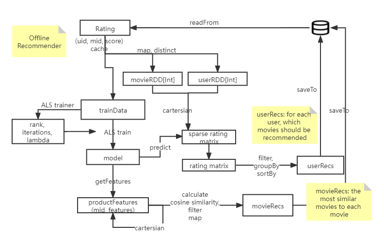
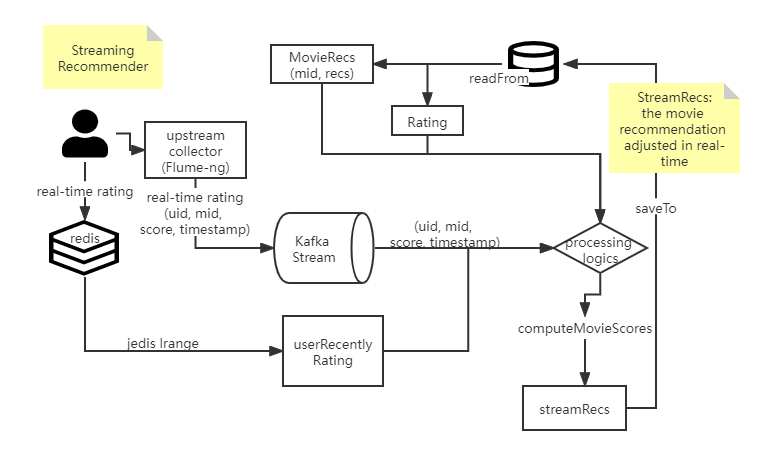

# RecommenderSystem

## Modules introduction

Here gives brief introduction of different modules

### DataLoader

Dataset source: [MovieLens](https://grouplens.org/datasets/movielens/)

preprocess the `movies.csv`, `ratings.csv`, `tags.csv` and store in MongoDB

### StatisticsRecommender

Recommend movies based directly on statistics, and
use Spark Core + Spark SQL to implement the statistics recommender to find:

- hottest movie (with most ratings)
- Recently hottest movies (group by month, then by ratings, DESC)
- Top Movies (with highest average rating)
- Each genre top movie (cross table)

### OfflineRecommender

Recommend based on Collaborative filtering, and
use Spark Core + Spark MLlib and ALS to implement offline recommender

- from latent features of users, recommend a list of movies for a user (use ALS algorithm)
- from the similarity of movies, recommend a list of similar movies for a movie (use cosine similarity)

### StreamingRecommender

Recommend in real-time, by collecting one single rating behavior of user in real-time send to Kafka, 
and process, compute the real-time recommendation list to update the MongoDB

* get the latest K times of rating from redis
* from similarity matrix, extract N most similar movies as the candidate list
* for every candidate movie, calculate the score and sort as current user's recommendation list

